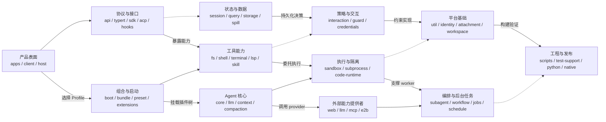

# Monorepo 模块全景

把 packages 目录下 254 个包按职责归入 12 个架构域，覆盖所有一级包组。

```mermaid
flowchart LR
  surfaces["产品表面<br/>apps / client / host"]
  composition["组合与启动<br/>boot / bundle / preset / extensions"]
  core["Agent 核心<br/>core / llm / context / compaction"]
  providers["外部能力提供者<br/>web / llm / mcp / e2b"]
  interfaces["协议与接口<br/>api / typert / sdk / acp / hooks"]
  capabilities["工具能力<br/>fs / shell / terminal / lsp / skill"]
  execution["执行与隔离<br/>sandbox / subprocess / code-runtime"]
  orchestration["编排与后台任务<br/>subagent / workflow / jobs / schedule"]
  state["状态与数据<br/>session / query / storage / spill"]
  policy["策略与交互<br/>interaction / guard / credentials"]
  platform["平台基础<br/>util / identity / attachment / workspace"]
  delivery["工程与发布<br/>scripts / test-support / python / native"]
  surfaces -->|选择 Profile| composition
  composition -->|挂载插件树| core
  core -->|调用 provider| providers
  interfaces -->|暴露能力| capabilities
  capabilities -->|委托执行| execution
  execution -->|支撑 worker| orchestration
  state -->|持久化决策| policy
  policy -->|约束实现| platform
  platform -->|构建验证| delivery
  surfaces --> interfaces
  composition --> capabilities
  core --> execution
  providers --> orchestration
  interfaces -.-> state
  capabilities -.-> policy
  execution -.-> platform
  orchestration -.-> delivery
```
