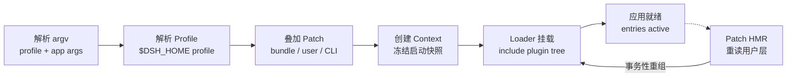

# Profile 启动与热重载流程

dsh 入口如何解析 Profile、叠加 bundle/user/CLI patch，并启动可热重载的 Cordis 插件树。

```mermaid
flowchart LR
  argv["解析 argv<br/>profile + app args"]
  profile["解析 Profile<br/>$DSH_HOME profile"]
  patches["叠加 Patch<br/>bundle / user / CLI"]
  context["创建 Context<br/>冻结启动快照"]
  mount["Loader 挂载<br/>include plugin tree"]
  ready["应用就绪<br/>entries active"]
  hmr["Patch HMR<br/>重读用户层"]
  argv --> profile
  profile --> patches
  patches --> context
  context --> mount
  mount --> ready
  ready -.-> hmr
  hmr -->|事务性重组| mount
```
