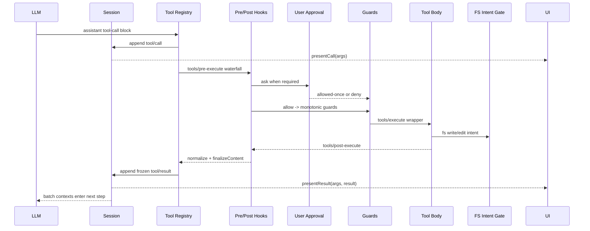

# 工具执行与策略管线

工具调用从持久化、权限审批、单调 guard、沙箱执行到结果冻结和 UI 呈现的完整数据流。

```mermaid
sequenceDiagram
  participant model as LLM
  participant session as Session
  participant registry as Tool Registry
  participant policy as Pre/Post Hooks
  participant approval as User Approval
  participant guards as Guards
  participant tool as Tool Body
  participant fs as FS Intent Gate
  participant ui as UI
  model->>registry: assistant tool-call block
  registry->>session: append tool/call
  session-->>ui: presentCall(args)
  registry->>policy: tools/pre-execute waterfall
  policy->>approval: ask when required
  approval-->>guards: allowed-once or deny
  policy->>guards: allow -> monotonic guards
  guards->>tool: tools/execute wrapper
  tool->>fs: fs write/edit intent
  tool-->>policy: tools/post-execute
  policy-->>registry: normalize + finalizeContent
  registry->>session: append frozen tool/result
  session-->>ui: presentResult(args, result)
  session-->>model: batch contexts enter next step
```
