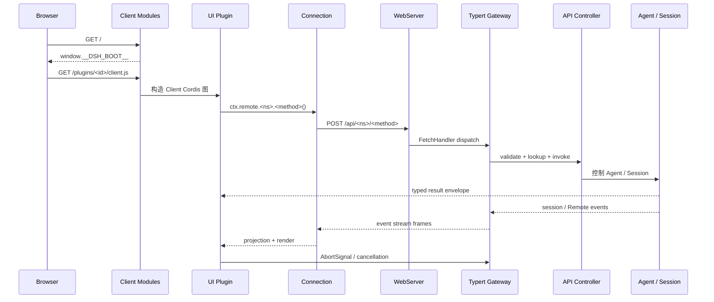

# Web 控制面启动与请求链路

浏览器插件图、Connection、WebServer、Typert Gateway 与业务 Controller 之间的请求和事件路径。

```mermaid
sequenceDiagram
  participant browser as Browser
  participant modules as Client Modules
  participant ui as UI Plugin
  participant connection as Connection
  participant webserver as WebServer
  participant gateway as Typert Gateway
  participant controller as API Controller
  participant agent as Agent / Session
  browser->>modules: GET /
  modules-->>browser: window.__DSH_BOOT__
  browser->>modules: GET /plugins/<id>/client.js
  modules->>ui: 构造 Client Cordis 图
  ui->>connection: ctx.remote.<ns>.<method>()
  connection->>webserver: POST /api/<ns>/<method>
  webserver->>gateway: FetchHandler dispatch
  gateway->>controller: validate + lookup + invoke
  controller->>agent: 控制 Agent / Session
  agent-->>ui: typed result envelope
  agent-->>gateway: session / Remote events
  gateway-->>connection: event stream frames
  connection-->>ui: projection + render
  ui->>gateway: AbortSignal / cancellation
```
