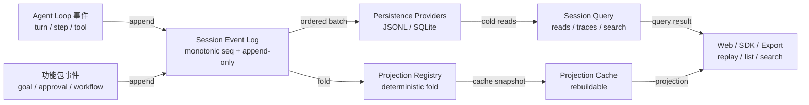

# 会话事件、投影与查询数据流

会话事件如何成为 append-only 事实，经 JSONL/SQLite 持久化、投影缓存、查询和遥测供不同消费者使用。

```mermaid
flowchart LR
  agentEvents["Agent Loop 事件<br/>turn / step / tool"]
  ownedEvents["功能包事件<br/>goal / approval / workflow"]
  session["Session Event Log<br/>monotonic seq + append-only"]
  persistence["Persistence Providers<br/>JSONL / SQLite"]
  projection["Projection Registry<br/>deterministic fold"]
  query["Session Query<br/>reads / traces / search"]
  cache["Projection Cache<br/>rebuildable"]
  consumers["Web / SDK / Export<br/>replay / list / search"]
  agentEvents -->|append| session
  ownedEvents -->|append| session
  session -->|ordered batch| persistence
  session -->|fold| projection
  persistence -->|cold reads| query
  projection -->|cache snapshot| cache
  query -->|query result| consumers
  cache -->|projection| consumers
```
