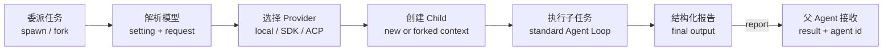

# 子代理委派与续接流程

父 Agent 如何选择模型和 provider，spawn/fork 子 Agent，并通过报告、控制与 continuation 回收结果。

```mermaid
flowchart LR
  delegate["委派任务<br/>spawn / fork"]
  model["解析模型<br/>setting + request"]
  route["选择 Provider<br/>local / SDK / ACP"]
  create["创建 Child<br/>new or forked context"]
  run["执行子任务<br/>standard Agent Loop"]
  report["结构化报告<br/>final output"]
  continue["父 Agent 接收<br/>result + agent id"]
  delegate --> model
  model --> route
  route --> create
  create --> run
  run --> report
  report -->|report| continue
```
