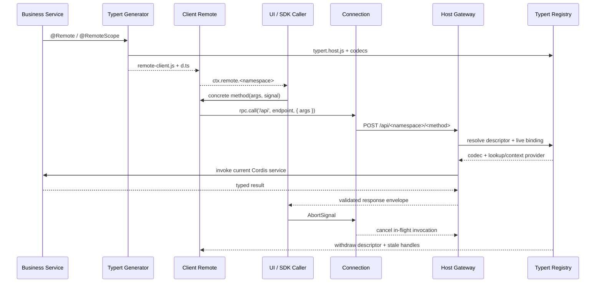

# Typert Remote API 调用时序

从 @Remote 声明和生成契约到浏览器调用、Host lookup、业务执行、响应校验与取消的严格链路。

```mermaid
sequenceDiagram
  participant business as Business Service
  participant generator as Typert Generator
  participant remoteClient as Client Remote
  participant ui as UI / SDK Caller
  participant connection as Connection
  participant gateway as Host Gateway
  participant registry as Typert Registry
  business->>generator: @Remote / @RemoteScope
  generator->>registry: typert.host.js + codecs
  generator-->>remoteClient: remote-client.js + d.ts
  remoteClient-->>ui: ctx.remote.<namespace>
  ui->>remoteClient: concrete method(args, signal)
  remoteClient->>connection: rpc.call('/api', endpoint, { args })
  connection->>gateway: POST /api/<namespace>/<method>
  gateway->>registry: resolve descriptor + live binding
  registry-->>gateway: codec + lookup/context provider
  gateway->>business: invoke current Cordis service
  business-->>gateway: typed result
  gateway-->>ui: validated response envelope
  ui->>connection: AbortSignal
  connection-->>gateway: cancel in-flight invocation
  registry-->>remoteClient: withdraw descriptor + stale handles
```
