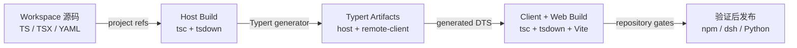

# 构建、契约生成与发布流水线

Host/Client 分阶段构建、Typert 代码生成、Web 打包、质量门禁与多语言/多运行时发布产物。

```mermaid
flowchart LR
  source["Workspace 源码<br/>TS / TSX / YAML"]
  hostTsc["Host Build<br/>tsc + tsdown"]
  contracts["Typert Artifacts<br/>host + remote-client"]
  clientTsc["Client + Web Build<br/>tsc + tsdown + Vite"]
  artifacts["验证后发布<br/>npm / dsh / Python"]
  source -->|project refs| hostTsc
  hostTsc -->|Typert generator| contracts
  contracts -->|generated DTS| clientTsc
  clientTsc -->|repository gates| artifacts
```
