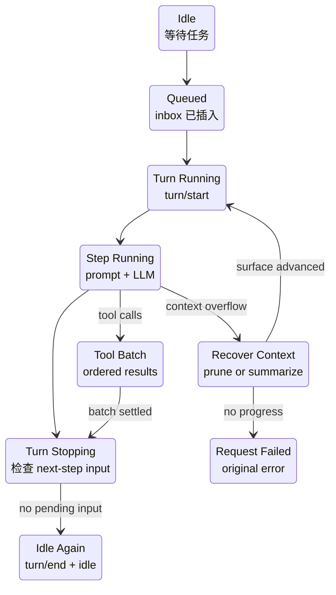

# Agent 运行状态生命周期

Agent 从 idle、排队、Turn/Step 执行到工具等待、重试、停止或失败的状态转换。

```mermaid
stateDiagram-v2
  state "Idle<br/>等待任务" as idle
  state "Queued<br/>inbox 已插入" as queued
  state "Turn Running<br/>turn/start" as turn
  state "Step Running<br/>prompt + LLM" as step
  state "Turn Stopping<br/>检查 next-step input" as stopping
  state "Recover Context<br/>prune or summarize" as retry
  state "Tool Batch<br/>ordered results" as tools
  state "Request Failed<br/>original error" as failed
  state "Idle Again<br/>turn/end + idle" as complete
  idle --> queued
  queued --> turn
  turn --> step
  step --> stopping
  stopping --> complete: no pending input
  step --> tools: tool calls
  tools --> stopping: batch settled
  step --> retry: context overflow
  retry --> turn: surface advanced
  retry --> failed: no progress
```
